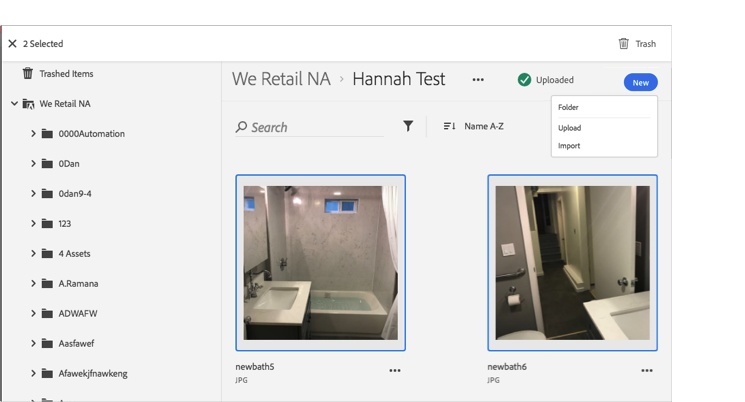

# Trash an Asset{#trash-an-asset}

You can trash an asset in the Adobe Experience Cloud Library to remove it from the Library.

To trash an asset in the Experience Cloud Library:

1. Click one or more assets to trash. 

1. Click the **[!UICONTROL Trash]** icon at the top of the page.

