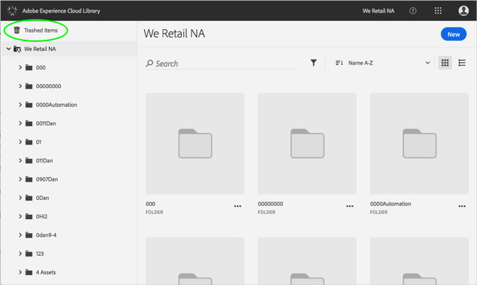

# Permanently Delete a Trashed Asset{#permanently-delete-a-trashed-asset}

You can permanently delete a trashed asset in the Adobe Experience Cloud Library.

When you trash an item, it lives in the Trashed Items area in the Experience Cloud Library for 60 days. If you do not restore items, Experience Cloud Library permanently deletes them after 60 days.

You can permanently delete a trashed asset sooner than 60 days by:

1. Click **[!UICONTROL Trashed Items]**.

   

1. Click one or more items to delete permanently.
1. Click on **[!UICONTROL More Info > Permanently delete]**.

   

1. Confirm that you want to permanently delete the selected assets.

