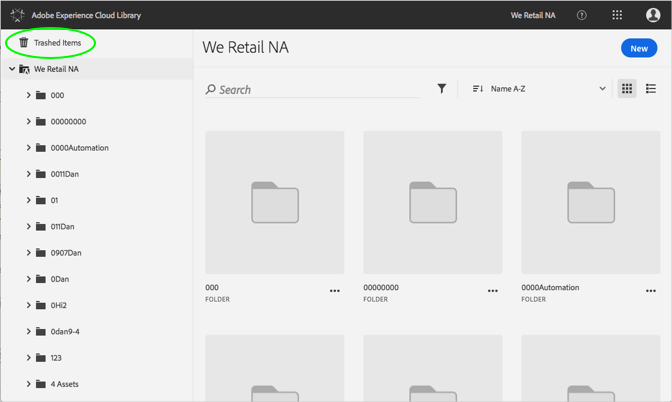
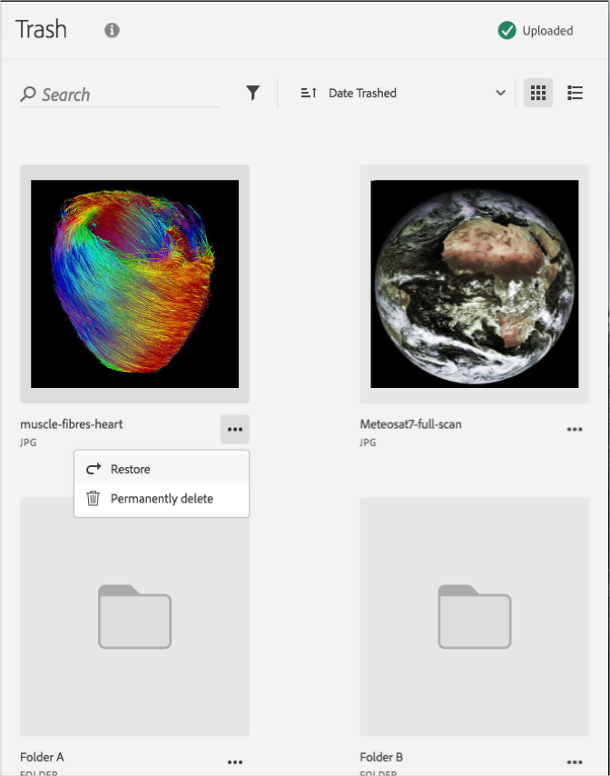

# Restore a Trashed Asset{#restore-a-trashed-asset}

You can restore an asset you trashed in the Adobe Experience Cloud Library.

When you trash an item, it lives in the Trashed Items area in the Experience Cloud Library for 60 days. If you do not restore items, Experience Cloud Library permanently deletes them after 60 days.

Restore a trashed asset sooner than 60 days by:

1. Click **[!UICONTROL Trashed Items]**.

   

1. Click one or more items to restore.
1. Click on **[!UICONTROL More Info > Restore]**.

   

1. Confirm that you want to restore the selected assets.

Confirmation of the restored asset displays at the top.
