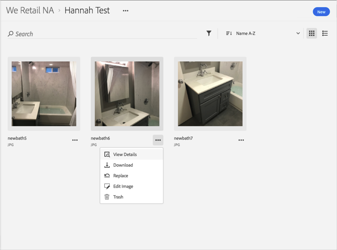

# Download an Asset{#download-an-asset}

You can download an asset in the Adobe Experience Cloud Library.

1. Click on an asset.
1. Click on the **[!UICONTROL More Options]** menu (ellipsis) next to the asset.

   

1. Click **[!UICONTROL Download]** to download the asset.

