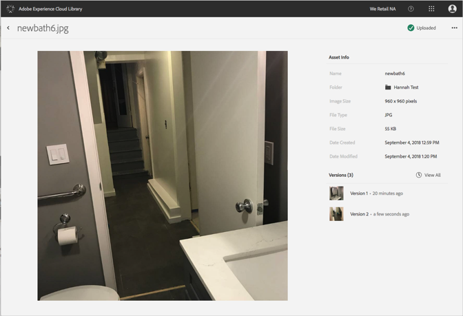

# Revert to an Older Version of an Asset{#revert-to-an-older-version-of-an-asset}

You can revert to an older version of an asset in the Adobe Experience Cloud Library.

To revert to an older version of an asset in the Experience Cloud Library:

1. Click on an asset.
1. Click on the **[!UICONTROL More Options]** menu (ellipsis) next to the asset.

   

1. Click **[!UICONTROL Asset Details]**.
1. Click on **[!UICONTROL View All]** next to Versions to see all versions of the asset.

   

1. In the list of versions, click on the **[!UICONTROL More Options]** menu (ellipsis) next to the version to which you want to revert.

   

1. Click **[!UICONTROL Revert]**.

The version to which you reverted now becomes the current versions. 
