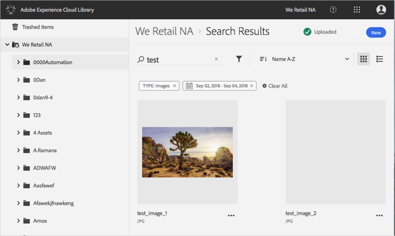

# Search for Assets{#search-for-assets}

Search for assets in the Adobe Experience Cloud Library to find assets across the organization or in a specific folder.

Search for assets in the Experience Cloud Library by using the search bar. The search looks through file names. 

