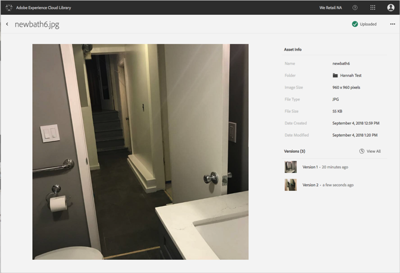

# View Detailed Information for an Asset{#view-detailed-information-for-an-asset}

View detailed information about assets, including versions, in the Adobe Experience Cloud Library.

To view detailed information about assets, including versions, in the Experience Cloud Library:

1. Click on an asset.
1. Click on the **[!UICONTROL More Options]** menu (ellipsis) next to the asset.

   

1. Click **[!UICONTROL View Details]** to view more details for an asset.

   

