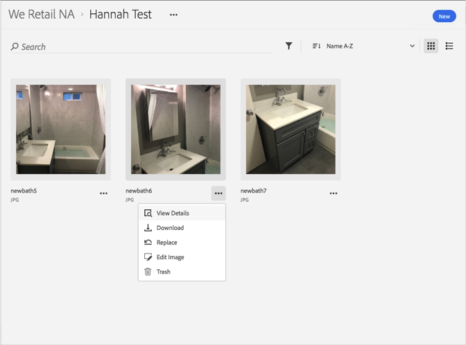

# Replace an Asset{#replace-an-asset}

You can replace an asset in the Adobe Experience Cloud Library.

To replace an asset in the Experience Cloud Library:

1. Click on an asset.
1. Click on the **[!UICONTROL More Options]** menu (ellipsis) next to the asset.

   

1. Click **[!UICONTROL Replace]**.
1. Select the new asset to replace the old one.

