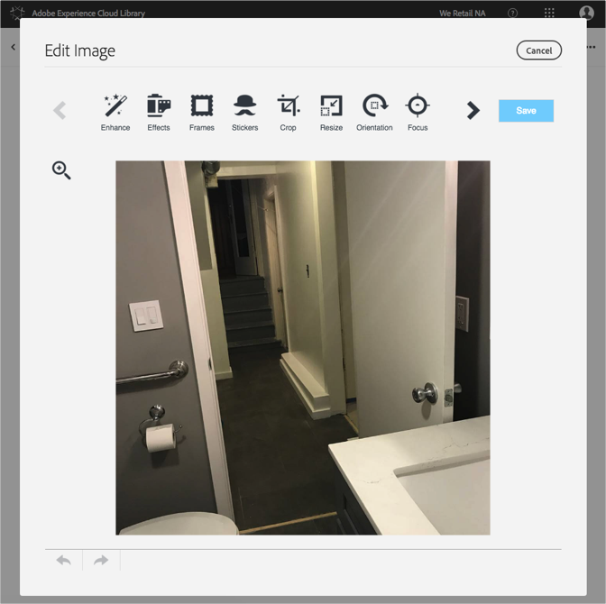

# Edit an Image{#edit-an-image}

Use the basic image editor built into the Adobe Experience Cloud Library to edit an image on the fly from the library directly.

To edit an image from the Experience Cloud Library:

1. Click on an image to edit.
1. Click edit image. When you save the image it will save as a new version.

   The image editor opens and you can edit the image.

   

