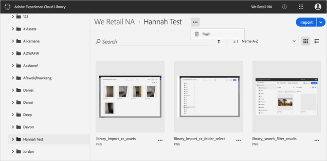
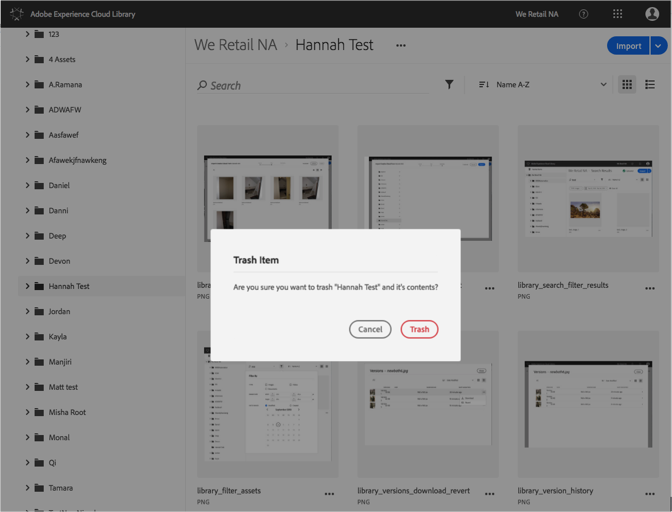

# Trash a Folder{#trash-a-folder}

You can trash a folder in the Adobe Experience Cloud Library.

To trash a folder in the Experience Cloud Library:

1. Click on the folder to trash.
1. Click the **[!UICONTROL More Options Menu]** (ellipsis) and select **[!UICONTROL Trash]**.

   

1. Confirm that you want to trash the folder. 

   

