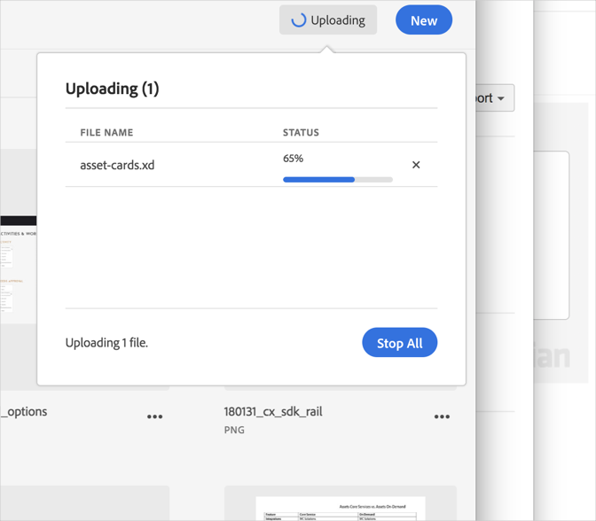

# Cancel an Upload{#cancel-an-upload}

Cancel an upload from your device to the Adobe Experience Cloud Library if you selected the incorrect or too large of a file.

To cancel an upload that has already started:

1. Click on the notification indicator.
1. Click **[!UICONTROL Stop All]** to stop all downloads or click on the **[!UICONTROL X]** next to individual files to cancel.

   

If you select one or more files with the same name, the Experience Cloud Library prompts you to replace the old versions or keep the new ones.
