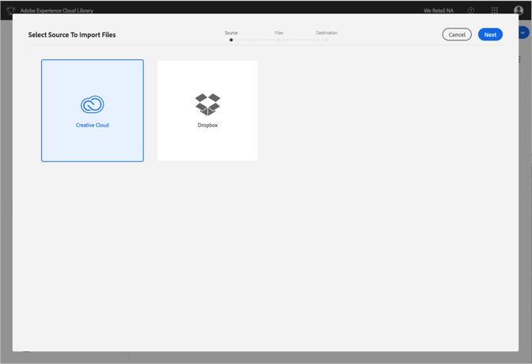
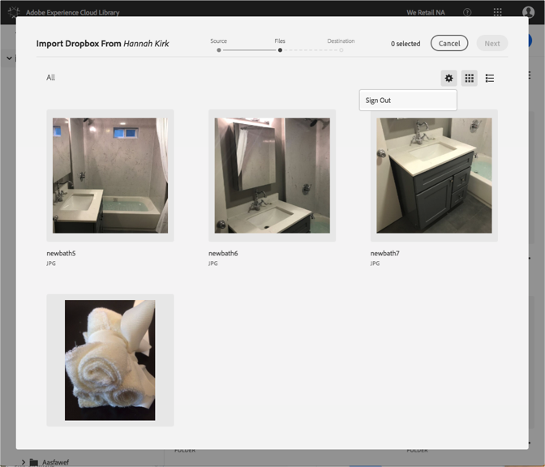

# Change Dropbox or Creative Cloud Accounts{#change-dropbox-or-creative-cloud-accounts}

Switch to a different Dropbox or Creative Cloud account to add content to the Adobe Experience Cloud Library.

Once you sign into a Dropbox or Creative Cloud account, you will stay signed in unless you sign out or switch accounts.

To switch to a different Dropbox or Creative Cloud account:

1. Select **[!UICONTROL New]** > **[!UICONTROL Import]**.

   

1. Select **[!UICONTROL Creative Cloud]** or **[!UICONTROL Dropbox]**.

   

1. Select **[!UICONTROL Next]**.
1. Select the gear icon in the upper right corner.

   

1. Select **[!UICONTROL Sign out]**.
1. Log into the other account.

