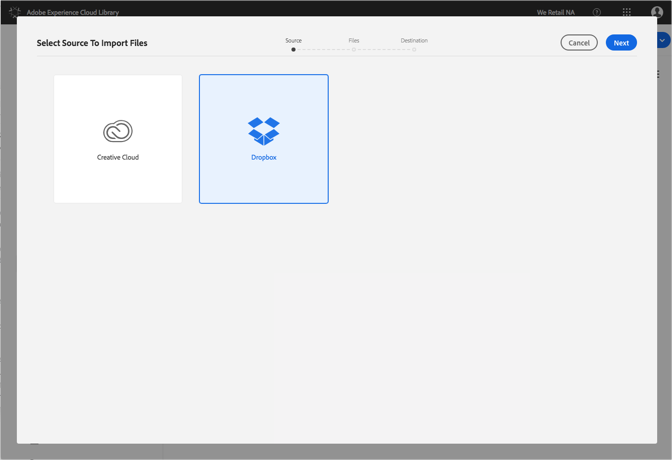

# Import Dropbox Files into the Adobe Experience Cloud Library{#import-dropbox-files-into-the-adobe-experience-cloud-library}

Import files from Dropbox into the Adobe Experience Cloud Library to manage them from any Adobe Experience Cloud product.

>[!NOTE]
>
>You must create a folder before you can perform this task.

To import Dropbox files into the Experience Cloud Library:

1. Select **[!UICONTROL New]** > **[!UICONTROL Import]**.

   

1. Select **[!UICONTROL Dropbox]**.

   Sign in to your Dropbox account, if you haven't already.

   

1. Click **[!UICONTROL Next]**.
1. Select one or more files to import.

   

1. Click **[!UICONTROL Next]**.
1. Select the folder in which to place the assets.

   >[!NOTE]
   >
   >You can choose one folder in which to import the assets. To place files in different folders, repeat this task for each folder.

   

1. Click **[!UICONTROL Import]**.

