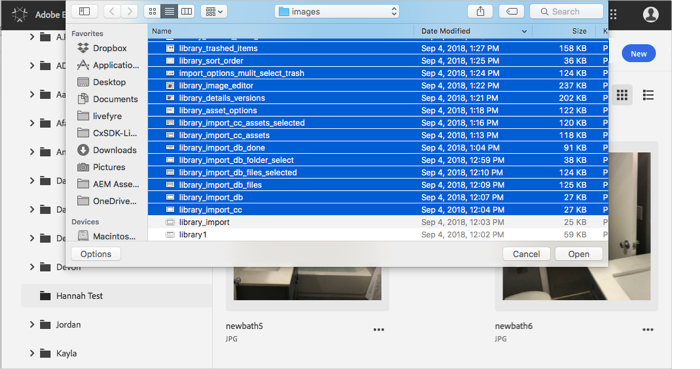
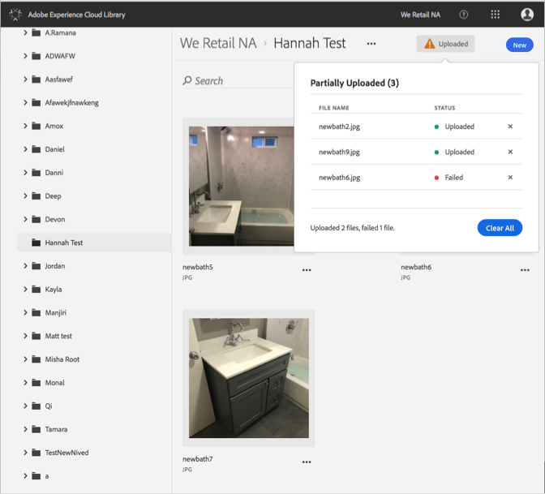

# Upload Asset from Device{#upload-asset-from-device}

Upload assets from your device to manage them in the Adobe Experience Cloud Library.

To upload assets from your device to the Experience Cloud Library:

1. Select **[!UICONTROL New]** > **[!UICONTROL Upload]**.

   

1. Select the assets to upload to the Experience Cloud Library.

   

1. When your files have competed uploading, a confirmation or any error messages display in the notification box.

   

